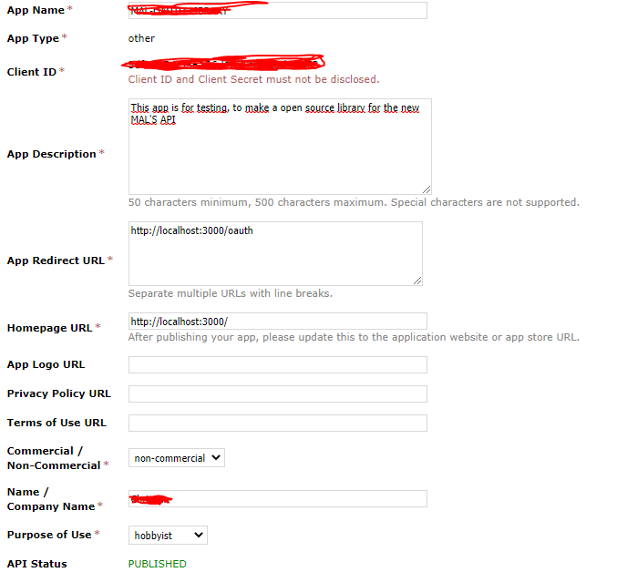

<!--
*** Thanks for checking out this README Template. If you have a suggestion that would
*** make this better, please fork the repo and create a pull request or simply open
*** an issue with the tag "enhancement".
*** Thanks again! Now go create something AMAZING! :D
***
***
***
*** To avoid retyping too much info. Do a search and replace for the following:
*** github_username, repo, twitter_handle, email
-->

<!-- PROJECT SHIELDS -->
<!--
*** I'm using markdown "reference style" links for readability.
*** Reference links are enclosed in brackets [ ] instead of parentheses ( ).
*** See the bottom of this document for the declaration of the reference variables
*** for contributors-url, forks-url, etc. This is an optional, concise syntax you may use.
*** https://www.markdownguide.org/basic-syntax/#reference-style-links
-->

[![Contributors][contributors-shield]][contributors-url]
[![Forks][forks-shield]][forks-url]
[![Stargazers][stars-shield]][stars-url]
[![Issues][issues-shield]][issues-url]
[![MIT License][license-shield]][license-url]
[![LinkedIn][linkedin-shield]][linkedin-url]

<!-- PROJECT LOGO -->
<br />
<p align="center">
  <h3 align="center">MyAnimeList - API V2</h3>

  <p align="center">
    An awesome library to connect with the new Mal's API v2!
    <br />
    <a href="https://github.com/Chris-Kode/myanimelist-api-v2"><strong>Explore the docs »</strong></a>
    <br />
    <br />
    <a href="https://github.com/Chris-Kode/myanimelist-api-v2/issues">Report Bug</a>
    ·
    <a href="https://github.com/Chris-Kode/myanimelist-api-v2/issues">Request Feature</a>
  </p>
</p>

<!-- TABLE OF CONTENTS -->

## Table of Contents

- [About the Project](#about-the-project)
  - [Built With](#built-with)
- [Getting Started](#getting-started)
  - [Prerequisites](#prerequisites)
  - [Install](#install)
- [Usage](#usage)
  - [Initial stepts before use the API](#initial-stepts-before-use-the-api)
  - [API_ANIME](#api_anime)
    - [animes](#animes)
    - [anime](#anime)
    - [animeRanking](#animeranking)
    - [animeSeasonal](#animeseasonal)
    - [animeSuggestions](#animesuggestions)
  - [API_MANGA](#api_manga)
    - [mangas](#mangas)
    - [manga](#manga)
    - [mangaRanking](#mangaranking)
- [Roadmap](#roadmap)
- [Contributing](#contributing)
- [License](#license)
- [Contact](#contact)

<!-- ABOUT THE PROJECT -->

## About The Project

This library has been made by the new MyAnimeList API update, as it has some notable changes, the library will continue to be updated and changes will be made as the official API is developed

### Built With

The library is made to be as light as possible.

- [NodeJS](https://github.com/nodejs/node)
- [Axios](https://github.com/axios/axios)

<!-- GETTING STARTED -->

## Getting Started

### Prerequisites

1. You are going to need register your application first for the use of this API, so you can register here [https://myanimelist.net/apiconfig/create](https://myanimelist.net/apiconfig/create)
   You will get a result like this:
   

2. Client_id and Client_Secret (if you need it) must not be disclosed.
3. App Redirect Url: In this field we must put the url to which it will be redirected after the user authorizes the use of his account in our application (can be localhost for test purpose)

<!-- USAGE EXAMPLES -->

## Install

Install the package to your project
`npm i @chris-kode/myanimelist-api-v2`

## Usage

This new API use PCKE for Oauth2 you can use this library to generate PCKE Challenge for the example i will use this library: [pkce-challenge](https://www.npmjs.com/package/pkce-challenge)

### Initial stepts before use the API

1.  To redirect to the url for authorize

    ```javascript
    const API = require("@chris-kode/myanimelist-api-v2");

    const oauth = new API.OAUTH(CLIENT_ID);
    const pkceChallenge = require("pkce-challenge");

    //save this variable value that contains the code_challenge and code_verification in a database or something
    const pkce = pkceChallenge();

    const urlToRedirect = oauth.urlAuthorize(pkce.code_challenge); // this generate the url that you need to redirect

    //This example is for expressjs, but you only need to do a redirection to the url generated
    res.redirect(urlToRedirect);
    ```

    When the user authorize you, the user will be redirected again to the url that you filled at the information of the application, with a param "code", you are going to save this code in a database or something.

2.  Then when we have this code, we will need to create a session or a Access Token like this:

    ```javascript
    const API = require("@chris-kode/myanimelist-api-v2");
    const oauth = new API.OAUTH(CLIENT_ID);

    //get the code that mal give us, and the code_challengue which we have generated before.
    oauth.accessToken(CODE, CODE_CHALLENGE).then(
      ((response) => {
        //PERFECT
        //save all the response at db or something, u will get something like this:
        /*{
            token_type: 'Bearer',
            expires_in: 2678400,
            access_token: 'eyJ0eXAiOiJKV1QiLCJhbGciOiJSUzI1NiIsImp0aSI6ImY4MWExNTIzYzBkZjI0MWNmNDlmZTg1Y2Y2MmQ5ZWU2ZDNjNDJlMGQ3ODIzN2I4ZjQ1NjkzMjUxZDdlYzhjZjIyYTVmNzdjZGY3MmJkMTkyIn0.e...,
            refresh_token: 'def502009f00fd0d08d50a7faca228bb4f88fa61df80e70aab290d6431115a16b44dc3e9215b3489a71caf9d594b8803129b6497619928025a420f107efd4560b45eb4e136bc4d0d72...'
        }*/
      }).catch((err) => {
        //ERROR
        //do something
      })
    );
    ```

3.  If the session is expired, you are going to need to refresh:

    ```javascript
    const API = require("@chris-kode/myanimelist-api-v2");
    const oauth = new API.OAUTH(CLIENT_ID);

    //REFRESH TOKEN that we generated before, when we create a Access Token
    oauth.refreshToken(REFRESH_TOKEN).then(
      ((response) => {
        //PERFECT
        //save all the response at db or something, u will get something like this:
        /*{
            token_type: 'Bearer',
            expires_in: 2678400,
            access_token: 'eyJ0eXAiOiJKV1QiLCJhbGciOiJSUzI1NiIsImp0aSI6ImY4MWExNTIzYzBkZjI0MWNmNDlmZTg1Y2Y2MmQ5ZWU2ZDNjNDJlMGQ3ODIzN2I4ZjQ1NjkzMjUxZDdlYzhjZjIyYTVmNzdjZGY3MmJkMTkyIn0.e...,
            refresh_token: 'def502009f00fd0d08d50a7faca228bb4f88fa61df80e70aab290d6431115a16b44dc3e9215b3489a71caf9d594b8803129b6497619928025a420f107efd4560b45eb4e136bc4d0d72...'
        }*/
      }).catch((err) => {
        //ERROR
        //do something
      })
    );
    ```

### API_ANIME

Initialize object

```javascript
//BEARER_TOKEN (ONLY THE TOKEN) = eyJ0eXAiOiJKV1QiLCJhbGciOiJSUzI1NiIsImp0aSI6ImY4MWExNTIzYzBkZjI0MWNmNDlmZTg1Y2Y2MmQ5ZWU2ZDNjNDJlMGQ3ODIzN2I4ZjQ1NjkzMjUxZDdlYzhjZjIyYTVmNzdjZGY3MmJkMTkyIn0.ey...
const anime = new API.API_ANIME(BEARER_TOKEN);
```

Structures
[structures.animeInList](src/Mal_Api_Authorized/Mal_Api_Anime/structures.json)

#### animes

(List of animes via a query text search)

Params:

- q => text to search (required)
- offset => default = 0
- limit => default = 100
- fields (Array) => fields to show, default = [structures.animeInList](src/Mal_Api_Authorized/Mal_Api_Anime/structures.json)

  Example:

  ```javascript
  //Simple query
  anime.animes("one piece");

  //Third page of one piece results, 50 limit, 100-150,
  anime.animes("one piece", 150, 50);
  ```

#### anime

(Specific anime by id, and return the anime with all details)

Params:

- id => number
- fields (Array) => fields to show, default = [structures.animeFull](src/Mal_Api_Authorized/Mal_Api_Anime/structures.json)

  Example:

  ```javascript
  anime.anime(21);
  ```

#### animeRanking

(Ranking animes, with all type of rankings)

Params:

- ranking_type => OPTIONS ["all" | "airing" | "upcoming" | "tv" | "ova" | "movie" | "special" | "bypopularity" | "favorite"] default = "all"
- offset => default = 0
- limit => default = 100
- fields (Array) => fields to show, default = [structures.animeInList](src/Mal_Api_Authorized/Mal_Api_Anime/structures.json)

  Example:

  ```javascript
  //Get all the ranking where is now airing
  anime.animeRanking("airing");

  //Third page of ranking results, 50 limit, 100-150,
  anime.animeRanking("all", 150, 50);
  ```

#### animeSeasonal

(Seasonal Anime, by default is filled at actual season)

Params:

- year => a year, default => currentYear
- season => OPTIONS ["winter" | "spring" | "summer" | "fall"], default => currentSeason
- offset => default = 0
- limit => default = 100
- sort => OPTIONS ["anime_score" | "anime_num_list_users" | ""], default => ""
- fields (Array) => fields to show, default = [structures.animeInList](src/Mal_Api_Authorized/Mal_Api_Anime/structures.json)

  Example:

  ```javascript
  //Get all the current anime season
  anime.animeSeasonal();

  //Get the animes season of winter 2010
  anime.animeSeasonal(2010, "winter");

  //Get the animes season of spring 2015, third page ordered by anime_score
  anime.animeSeasonal(2015, "spring", 150, 50, "anime_score");
  ```

#### animeSuggestions

(Anime suggestion from MAL)

Params:

- offset => default = 0
- limit => default = 100
- fields (Array) => fields to show, default = [structures.animeInList](src/Mal_Api_Authorized/Mal_Api_Anime/structures.json)

  Example:

  ```javascript
  //Get the anime suggestion from MAL
  anime.animeSuggestions();
  ```

<!-- ROADMAP -->

### API_MANGA

Initialize object

```javascript
/*BEARER_TOKEN (ONLY THE TOKEN) = eyJ0eXAiOiJKV1QiLCJhbGciOiJSUzI1NiIsImp0aSI6ImY4MWExNTIzYzBkZjI0MWNmNDlmZTg1Y2Y2MmQ5ZWU2ZDNjNDJlMGQ3ODIzN2I4ZjQ1NjkzMjUxZDdlYzhjZjIyYTVmNzdjZGY3MmJkMTkyIn0.ey...
 */
const manga = new API.API_MANGA(BEARER_TOKEN);
```

#### mangas

(List of mangas via a query text search)

Params:

- q => text to search (required)
- offset => default = 0
- limit => default = 100

  Example:

  ```javascript
  //Simple query
  manga.mangas("one piece");

  //Third page of one piece results, 50 limit, 100-150,
  manga.mangas("one piece", 150, 50);
  ```

#### manga

(Specific manga by id, and return the manga with all details)

Params:

- id => number

  Example:

  ```javascript
  //Simple query
  manga.manga(13);
  ```

#### mangaRanking

(Ranking mangas, with all type of rankings)

Params:

- ranking_type => OPTIONS => ["all" | "manga" | "novels" | "oneshots" | "doujin" | "manhwa" | "manhua" | "bypopularity" | "favorite"], default => "all"
- offset => default = 0
- limit => default = 100

  Example:

  ```javascript
  //Get all the ranking where are mangas
  manga.mangaRanking("manga");

  //Third page of ranking results, 50 limit, 100-150,
  anime.mangaRanking("all", 150, 50);
  ```

## Roadmap

See the [open issues](https://github.com/Chris-Kode/myanimelist-api-v2/issues) for a list of proposed features (and known issues).

<!-- CONTRIBUTING -->

## Contributing

Contributions are what make the open source community such an amazing place to be learn, inspire, and create. Any contributions you make are **greatly appreciated**.

1. Fork the Project
2. Create your Feature Branch (`git checkout -b feature/AmazingFeature`)
3. Commit your Changes (`git commit -m 'Add some AmazingFeature'`)
4. Push to the Branch (`git push origin feature/AmazingFeature`)
5. Open a Pull Request

<!-- LICENSE -->

## License

Distributed under the MIT License. See `LICENSE` for more information.

<!-- CONTACT -->

## Contact

Christian Andrés Bacho - [@FarokStyle](https://twitter.com/FarokStyle) - christian.andres.1204@gmail.com

Project Link: [https://github.com/Chris-Kode/myanimelist-api-v2](https://github.com/Chris-Kode/myanimelist-api-v2)

<!-- MARKDOWN LINKS & IMAGES -->
<!-- https://www.markdownguide.org/basic-syntax/#reference-style-links -->

[contributors-shield]: https://img.shields.io/github/contributors/Chris-Kode/myanimelist-api-v2.svg?style=flat-square
[contributors-url]: https://github.com/Chris-Kode/myanimelist-api-v2/graphs/contributors
[forks-shield]: https://img.shields.io/github/forks/Chris-Kode/myanimelist-api-v2.svg?style=flat-square
[forks-url]: https://github.com/Chris-Kode/myanimelist-api-v2/network/members
[stars-shield]: https://img.shields.io/github/stars/Chris-Kode/myanimelist-api-v2.svg?style=flat-square
[stars-url]: https://github.com/Chris-Kode/myanimelist-api-v2/stargazers
[issues-shield]: https://img.shields.io/github/issues/Chris-Kode/myanimelist-api-v2.svg?style=flat-square
[issues-url]: https://github.com/Chris-Kode/myanimelist-api-v2/issues
[license-shield]: https://img.shields.io/github/license/Chris-Kode/myanimelist-api-v2.svg?style=flat-square
[license-url]: https://github.com/Chris-Kode/myanimelist-api-v2/blob/master/LICENSE.txt
[linkedin-shield]: https://img.shields.io/badge/-LinkedIn-black.svg?style=flat-square&logo=linkedin&colorB=555
[linkedin-url]: https://www.linkedin.com/in/christian-andr%C3%A9s-bacho-a5abb016b/
